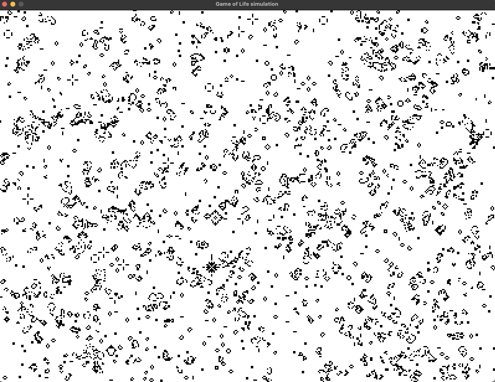

# Project Description

This project contains the Python code for the Game of Life simulation. The Game of Life is a cellular automaton devised by the British mathematician John Horton Conway. It is a zero-player game that simulates the evolution of a population of cells based on a set of rules.

## Instructions

To run the Python code for the Game of Life, follow these steps:

1. Clone the repository to your local machine:

    ```bash
    git clone https://github.com/your-username/game_of_life.git
    ```

2. Navigate to the project directory:

    ```bash
    cd game_of_life
    ```

3. Install the required dependencies:

    ```bash
    pip install -r requirements.txt
    ```

4. Run the Python script:

    ```bash
    python main.py
    ```

    This will start the simulation and display the initial state of the game.

5. Follow the on-screen instructions to interact with the game. You can pause/resume the simulation, advance to the next generation, and exit the game.

## License

This project is licensed under the MIT License. See the [LICENSE](./LICENSE) file for more information.


An example of a simulation : 

